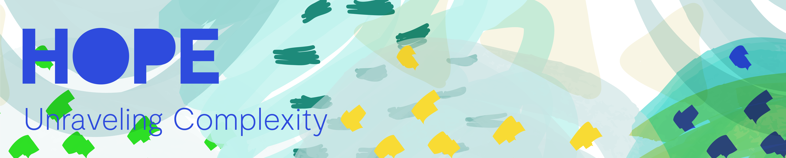

# The Little Book of HOPE

  
Consensys has seen exponential growth in a relatively short period of time, maintaining and scaling this momentum is at the heart of HOPE.This document aspires to find alignment, focus and clarity in moving forward on this exciting momentous journey.  
  
To build value and provide compelling customer experiences \(for employees, consumers and clients alike\) we need to commit to the next phase of our operating system. The following proposed operating system is a fresh way of running the organization that combines people, technology and operations capabilities in an integrated, well-sequenced way to achieve small but consistent improvements in employee happiness, customer experience, revenue and cost-efficiency based on learnings from our experience.  
  
The learnings from past operating experiences can be broken down into two parts, each requiring Consensys MENA to adopt changes in the way we work:  
  
The first part involves a shift from running uncoordinated efforts within silos to launching an integrated operational-improvement program \(and the reason why the HOPE Circle was created\) organized around user journeys \(the set of interactions a user has with a company when making a purchase or receiving services\) as well as the internal journeys \(end-to-end processes inside the company\).

The second part is a shift from using individual technologies, operations capabilities, and approaches in a piecemeal manner inside siloes to applying them to journeys in combination and in the right sequence with cross-functional Circles through collaboration and consensus to achieve compound impact.  
  
This document does not have a bag of ready made answers, we are addressing exactly that the – ready made answers – the status quo, current and legacy operatus modus and thinking, therefore get involved! This is an experiment. Everything inside this document and subject matter is open-source for critique, contribution and collaboration, thus deemed an "experiment". This simply equates to – we endeavour to make the best use of what is in our power, and treating the rest in accordance with its nature.  
  
What we’ve learnt to be true

* Be nice.
* Uncompromised temperament and tenacity through a core leadership team who exemplify self-awareness, self-management, social-management and relationship-management, respect and kindness
* We respect individualism as away for equality and collectivism that promotes groups into cohesive interdependent operable
* We will always desire to be a flat, collaborative and non-hierarchical organization
* Individuals can and should always instigate change
* Good decision-making implies alignment \(action through a decision\), not \(only\) consensus
* Ownership is accountability, not authority or control
* Decision-making should be distributed, though not evenly or permanently
* Corporate transparency, driven by technology
* The system should alway be designed to be adaptable

## Preface

`This is an experiment. Everything inside this document and subject matter is open-source for critique, contribution and collaboration, thus deemed an "experiment". Diverge, test, iterate and repeat.`

Short introduction on the purpose of this documentation and how it started. Why, How and What.

`Explain the motives, the purpose of this documentation. Include the HD, BF, TV venn diagram.`

